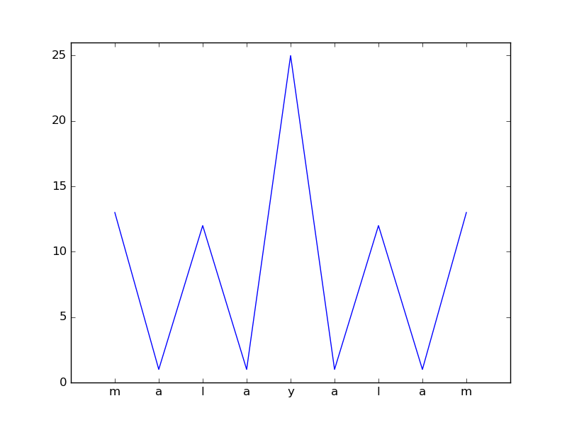

# Implement line chart for words from a dictionary

Takes words from the word list file and displays a line chart with
values a-z mapped to 1-26. 

# Usage
Modify wordlist file and run
```
./plot-words.py

or 

python plot-words.py
```
# Examples




# Requirements

- matplotlib 
